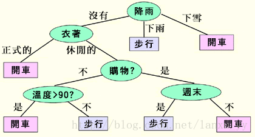

# 前言
在这个物欲横流的社会中，任何物品都是明码实价的，甚至许多虚拟的物品（爱情、亲情）都可能用金钱来衡量。对于计算器科学而言，我们也希望能对信息做一个量化的衡量。比如，这篇博客包含多少信息量。可能有的人会说这个问题很简单啊，我们可以通过字数来衡量，但是仔细想想，这是占不住脚的。例如，提到“苹果”，很多人都能够联想到这个物品的形状、颜色、味道等，信息量非常大。而提到“鼋鼍”，或许我们完全不知道这是什么，但是至少我们学习到了这样一个新的词汇。因此，我们要搞清楚一件非常非常 不确定的事，或是我们一无所知的事情，就需要了解大量的信息。相反，如果我们对某件事已经有了较多的了解，我们不需要太多的信息就能把它搞清楚。可以见得，一条信息的信息量大小和它的不确定性有直接的关系。

找到信息的度量与不确定性相关后，我们便可以来想想如何度量信息。我引用Google黑板报《数学之美》中的例子，马上要举行世界杯赛了，大家都很 关心谁会是冠军。假如我错过了看世界杯，赛后我问一个知道比赛结果的观众“哪支球队是冠军”？ 他不愿意直接告诉我， 而要让我猜，并且我每猜一次，他要收一元钱才肯告诉我 是否猜对了，那么我需要付给他多少钱才能知道谁是冠军呢? 我可以把球队编上号，从1到32， 然后提问： “冠军的球队在 1-16 号中吗?” 假如他告诉我猜对了， 我会接着问： “冠军在 1-8 号中吗?” 假如他告诉我猜错了， 我自然知道冠军队在 9-16 中。 这样只需要五次， 我就能知道哪支球队是冠军。所以，谁是世界杯冠军这条消息的信息量只值五块钱。 

上述故事中，将球队编号成1到32的过程其实就是将人类的语言转化成了计算机能理解的数学语言。而获取信息的过程也就表现出了获得信息的复杂度，也是信息的不确定度。（确定的信息复杂度应当更小）那么，现在就让我们来看看信息是如何来衡量的吧？

##信息论中的熵
1948 年，香农提出了“信息熵” (shāng) 的概念，解决了对信息的量化度量问题。当然，香农不是用钱，而是用 “比特”（bit）这个概念来度量信息量。 一个比特是一位二 进制数，计算机中的一个字节是八个比特。在上面的例子中，这条消息的信息量是五比特。所以信息量的度量与对数函数有关，为log2n。

可能有人会发现现我们实际上可能不需要猜五次就能猜出谁是冠军，因为象巴西、德国、意大利这样的球队得冠军的可能性比日本、美国、韩国等队大的多。因此，我们可以把少数几个最可能的球队分成一组，把其它队分成另一组。依次类推便能很快猜出世界杯的冠军。所以对于分布不平衡的组合，信息熵的定义如下，pk代表第k类在所有类中出现的概率。

##信息熵的应用
看完了问题的背景，或许很多人还是不知道熵到底有什么实际的意义。就让我们用实例来了解一下熵的作用吧。

###应用1 压缩文件
我们拿英文文本举例，单个字母确实能够传递表达单个字母的信息，而字母的组合常常会有冗余。举例来讲，看”lov“通常我们也能猜到这个单词是”love“，因为似乎没有”lov“这个词。中文段落也存在冗余性，大家可以尝试读一读后面这段文字。“研表究明，汉字序顺并不定一影阅响读。比如当你看完这句话后，才发这现里的字全是都乱的。”显然这段文字是有冗余的，因此即使顺序不变了我们也能理解文字的含义。

计算机中的字母都是用比特（bit）来存储的，一个比特代表0或者1。如果未经压缩，一段英文文本的每个字母需要8个比特来编码，但是实际上英文文本的熵大概只有4.7比特。因此这样的消息是可以被压缩的，但是香农的信息理论揭示了，任何无损压缩技术不可能让一比特的消息携带超过一比特的信息。消息的熵乘以消息的长度决定了消息可以携带多少信息。

###应用2 数据挖掘
我们来谈谈时髦的大数据吧！数据挖掘中有一类很重要的应用是分类器，我们拿最简单的决策树分类器来举例。假设我们是一家智能的租车公司，因此我们需要分析用户在什么样的情况下会用车，然后在用户可能需要用车的时候通过手机应用或者短信推送促销信息。那么我们要怎么分析用户的行为呢?可以交给计算机来做数据挖掘。

首先，我们可以从传统的租车公司拿到历史用户租车的记录，假设主要数据如下（局部引用）
顾客信息	天气	衣着	购物	周末	温度>90	 
顾客1	下雨	正式的	是	是	否	步行
顾客2	下雪	休闲的	否	否	是	开车
顾客3	没有	休闲的	否	否	否	步行
顾客4	下雨	正式的	是	是	否	步行
顾客5	没有	休闲的	是	否	是	步行
顾客6	没有	正式的	否	否	否	开车
顾客7	下雪	正式的	否	是	是	开车
顾客8	下雨	正式的	是	否	是	步行
顾客9	下雪	休闲的	是	是	是	开车
顾客10	没有	正式的	否	否	是	开车

然后，我们可以用构造一棵决策树（如下图）。对于一个新的潜在用户，我们可以依次按照决策树中的条件（绿色椭圆标识）来判断用户是否会选择开车。嘻嘻，对于那些要开车的人，显然就是我们的潜在客户。

对于某一个特点条件的处理非常简单，可以用概率的方法来处理。例如天气的记录是”没有“，衣着的记录是”正式的“的历史顾客中97%的顾客都选择开车，那么我们就可以认为符合该条件的顾客很可能会开车。

那么，另外有一个问题需要我们注意，即条件的顺序性。通俗点讲，我们应当把衣着条件还是天气条件放在决策树根结点呢？这个重要的问题我们就能够通过信息熵来解决！我们可以知道一开始拿到整个历史数据时，我们并不知道数据到底有什么含义（即表示什么样的用户会开车），也可以说信息的不确定度很大。通过分类器的学习，我们希望讲信息的不确定度变小，以便让我们拥有新的顾客的时候能够预测顾客的行为。

我们用以上的部分数据来解释这个选择根结点的过程：

**1）**在未对数据做任何处理的情况下，需要预测结果当中有两种选择：开车与步行。开车出现了5次，步行出现了5次，用信息熵来评价这个分布的信息量则是entropy = -0.5log2(0.5)-0.5log2(0.5) = 1

**2）**如果我们按照天气来划分，“下雪”条件中的分布是（开车：3；步行：0），“下雨”条件中的分布是（开车：0；步行：3），“没有”条件中的分布是（开车：2；步行：2）。三个条件的熵分别是entropy[下雪] = -1log2(1)-0log2(0) = 0，entropy[下雨] = -0log2(0)-1log2(1) = 0，entropy[没有] = -0.5log2(0.5) - 0.5log2(0.5) = 1。由于10条数据被分为了三组数据，所以分割后的信息熵平均值为0.3*0 + 0.3*0 + 0.4*1 = 0.4。

**3）**如果我们按照衣着来划分，“正式的”条件的分布是（开车：3；步行：3），“休闲的”条件中的分布是（开车：2；步行：2）。两个条件的熵分别是entropy[正式的] = -0.5log2(0.5) - 0.5log2(0.5) = 1，entropy[休闲的] = -0.5log2(0.5) - 0.5log2(0.5) = 1。由于10条数据被分为了两组数据，所以分割后的信息熵平均值为 0.6*1 + 0.4*1 = 1。

显而易见，第二步相对第一步的信息减少量为1-0.4=0.6，而第三步相对第一步的信息减少量为1-1=0。也就是说第二种分布让信息不是那么不确定了，而第三种分布让信息依然不确定。所以很明显，第二种分布满足我们降低不确定度的要求并且优于第三种分布，我们应当按照这样的方法来划分。依次类推我们就能构造出整个决策树。

信息熵在决策树中的计算过程起了非常大的作用，它能够帮助我们从众多潜在的决策树中找到最有效的那一个。

#问题总结
信息熵的提出本是通信系统中的一场革命，然后随着计算机科学的发展，信息熵逐渐地影响了像数据挖掘这样的前沿计算机技术，对于计算机技术的发展有着重大的意义

